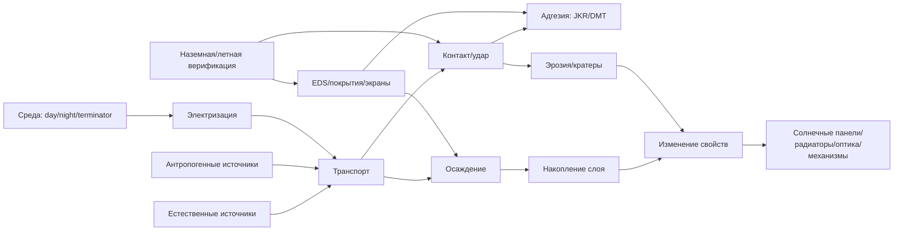

# Граф понятий — стартовая проекция

```mermaid
graph LR
  ENV[Среда: day/night/terminator] --> CHG[Электризация]
  NAT[Естественные источники] --> TR[Транспорт]
  ANT[Антропогенные источники] --> TR
  CHG --> TR
  TR --> DEP[Осаждение]
  TR --> IMP[Контакт/удар]
  IMP --> ADH[Адгезия: JKR/DMT]
  IMP --> ERO[Эрозия/кратеры]
  DEP --> ACC[Накопление слоя]
  ACC --> DEG[Изменение свойств]
  ERO --> DEG
  DEG --> PV[Солнечные панели/радиаторы/оптика/механизмы]
  EDS[EDS/покрытия/экраны] --> DEP
  EDS --> ADH
  TEST[Наземная/летная верификация] --> IMP
  TEST --> EDS
```
Агент должен дополнить граф source/claim/parameter-связями, но не превращать его в копию всей библиографии.
